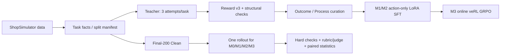

# Shopping GRPO: Reproducible Post-Training for Long-Horizon Shopping Agents

> A Baseline → SFT → GRPO → Evaluation study built around ShopSimulator and Qwen3.5-2B.

[中文 README](README.md) · [Architecture](docs/architecture.md) · [Data pipeline](docs/data-pipeline-v1.md) · [Results](docs/results-v1.md) · [Reproducibility](docs/reproducibility-v1.md) · [Limitations](docs/limitations.md)

## Positioning / TL;DR

This project tests whether supervised fine-tuning and online GRPO can make a long-horizon shopping agent reliable at tool use. The agent must search, inspect products, select variants, and purchase in an interactive environment.

Frozen Final-200 Clean results use a fixed denominator of 200:

| Model | Strict gold success |
|---|---:|
| M0 Base | 2/200 (1.0%) |
| M1 Outcome SFT | 137/200 (68.5%) |
| M2 Process SFT | 130/200 (65.0%) |
| M3 GRPO (step-100 export) | 139/200 (69.5%) |

SFT supplies the main gain (M0→M1 **+67.5pp, p<0.0001**). Process selection does not beat Outcome (M1→M2 **−3.5pp, p=.230**). Under `lr=1e-6`, LoRA `r=16`, and `n=4` rollouts per prompt, GRPO step100 improved over M2 by **+4.5pp** (16 wins, 7 losses; two-sided exact McNemar **p=.093**), a positive direction that does not reach the 0.05 significance level. The GRPO contract is `total_training_steps=500` with `save_freq=50`; this run stopped at 100 optimizer steps and exported step100. Infrastructure invalidity is 1–2%, above the project’s `<1%` target, and remains in the denominator.

## ShopSimulator

[ShopSimulator](https://arxiv.org/pdf/2601.18225) is a Chinese interactive environment for long-horizon shopping agents. Tasks combine category, budget, brand, model, feature, and variant constraints. The agent searches, opens details, verifies attributes, selects a variant, and purchases; terminal outcomes are checked by deterministic Reward v3.

The frozen runtime is included at [`environments/ShopSimulator/`](environments/ShopSimulator/), with environment `shopsimulator-environment-v2.1` and reward `shopsimulator-reward-v3`.

## End-to-end architecture



All stages share the environment, tool schema, Action Guard, Observation projection, and Reward version. Manifests and hashes bind runtime identity. GRPO trains only on valid Reward v3 terminal utility; LLM judges are offline explanatory tools, not training rewards or checkpoint selectors.

## Data cleaning

The decompressed upstream task-facts source contains **23,421** rows. Frozen splits are Teacher pool 1,300, GRPO train 1,000, GRPO validation 50, and Final-200 Clean 200. Each Teacher task has three attempts; infrastructure retries retain request identity and are not counted as new policy samples.

The curation sequence is:

1. Build leakage components from task/product identity, normalized queries, templates, explicit model tokens, and product families; isolate Final-200 first.
2. Require a terminal `done/over`, `reward_valid=true`, and complete `gold_purchase` under Reward v3.
3. Reject illegal actions, malformed schemas, structurally damaged trajectories, missing evidence, and unverifiable terminals while retaining rejection reasons.
4. From successful trajectories of the same task, build Outcome (first qualifying trajectory) and Process (actor-visible process-feature selection) datasets.
5. Load only manifest-approved tasks; never use Final-200 for data selection, thresholds, or checkpoint tuning.

The audited collection counts are 2,100 valid strategy attempts, 2,370 append-only raw rows, 1,343 strict-gold trajectories, and 1,265 trajectories across 512 usable tasks after hard checks. The curated split is train 400, dev 100, and reserve 12. After the 24,576-token shared-union length gate and difficulty-matched reserve, the true SFT-ready input is train 398 rows and dev 100 rows; Outcome and Process have equal task sets. The curated count of 400 is not the final training-row count.

## Model matrix

| ID | Initialization / data | Purpose |
|---|---|---|
| M0 | Qwen3.5-2B base | Tool-use baseline |
| M1 | M0 + Outcome action-only LoRA SFT | First qualifying successful trajectory |
| M2 | M0 + Process action-only LoRA SFT | Same-task process-aware selection |
| M3 | M2 + online GRPO; 500-step contract; controlled stop and export at optimizer step 100 | Test for an additional online-reward gain |

SFT computes loss only on assistant action tokens; the query and environment observations are masked. M3 starts from M2. Its frozen contract is `total_training_steps=500` and `save_freq=50`; this run stopped at 100 optimizer steps through an internal exact-step barrier and used the step-100 export for evaluation.

## Training method

- SFT: single-GPU LoRA, rank 16 and alpha 32; Outcome and Process use identical task IDs.
- GRPO: veRL 0.8.0 online rollouts, four trajectories per prompt, learning rate `1e-6`, with a `total_training_steps=500` and `save_freq=50` contract. This run stopped at 100 optimizer steps through the controlled barrier. Dynamic sampling handles uninformative groups without changing Reward v3.
- Merged exports carry independent manifests; the M3 adapter is merged into the M2 base before serving.

## Unified evaluation

Every model uses the same Final-200 Clean split, environment, and protocol: one rollout per task and a fixed denominator of 200. The evaluator normalizes trajectories, applies Action Guard and terminal checks, freezes per-task rubric constraints from private TaskFacts, judges only a de-identified valid trace, and reports fixed-denominator metrics plus task-paired exact McNemar and bootstrap comparisons.

Infrastructure-invalid tasks stay in the denominator and are `not_judged` on the judge side. Reward values, private gold fields, success labels, and other model results are withheld from the trajectory judge.

## Final-200 results

| Model | Strict success | Infra invalid | Mean steps | Mean terminal utility |
|---|---:|---:|---:|---:|
| M0 Base | 2/200 (1.0%) | 2 | 5.40 | −0.100 |
| M1 Outcome SFT | 137/200 (68.5%) | 3 | 12.05 | +0.584 |
| M2 Process SFT | 130/200 (65.0%) | 4 | 11.50 | +0.553 |
| M3 GRPO step100 | 139/200 (69.5%) | 2 | 11.25 | +0.602 |

Paired deltas are M0→M1 +67.5pp (p<0.0001), M1→M2 −3.5pp (p=.230), and M2→M3 +4.5pp (16 wins, 7 losses; exact McNemar p=.093). See the [v1 results report](docs/results-v1.md).

## Interpretation and limitations

The evidence supports successful-trajectory SFT as the main capability source. It does not show that Process selection is better, nor does it generalize the GRPO finding beyond this recipe. The precise claim is that step100 improves directionally over M2, but does not reach the 0.05 significance level on this sample.

Limitations include one fixed-protocol Final-200 run (no estimate of seed variance), a simulated shopping environment, 1–2% infrastructure invalidity above the `<1%` target, a 500-step GRPO contract that was controlled-stopped at 100 optimizer steps with a small LoRA update and one learning rate, and an LLM judge intended for explanation rather than replacing deterministic strict success.

## Quick start

On Linux with Python 3.10+, CUDA, and `uv`:

```bash
bash scripts/setup.sh
bash scripts/start_environment.sh
bash scripts/serve_model.sh Qwen/Qwen3.5-2B
bash scripts/baseline.sh
```

Then train and evaluate:

```bash
bash scripts/sft.sh
bash scripts/serve_model.sh outputs/models/sft-merged
bash scripts/evaluate.sh sft

bash scripts/grpo.sh --dry-run
bash scripts/grpo.sh
bash scripts/export_grpo.sh <checkpoint>/actor <verl-fsdp-export-dir>
PYTHONPATH=src python scripts/merge_grpo_lora.py --help
PYTHONPATH=src python scripts/merge_grpo_lora.py \
  --base-dir <verl-fsdp-export-dir> \
  --output <standalone-hf-dir> \
  --source-run-id <run-id>
bash scripts/serve_model.sh <standalone-hf-dir>
bash scripts/evaluate.sh grpo
```

`export_grpo.sh` only performs the veRL/FSDP export. Because the actor is a PEFT LoRA checkpoint, run `scripts/merge_grpo_lora.py` (inspect `--help` first) to produce a standalone HF model before serving or evaluating it.

See the [reproducibility guide](docs/reproducibility-v1.md) for identity checks and a cost-aware order of operations.

## Repository tree

```text
configs/                         runtime, tool, and GRPO configuration
data/                            SFT, GRPO, evaluation inputs and metadata
docs/                            public architecture, data, results, and QA notes
environments/ShopSimulator/     frozen environment, Reward v3, and product source
experiments/                     baseline, sft, grpo, and comparison
experiments/commerce-v1/         canonical v1 result/archive namespace
scripts/                         setup, training, export, and evaluation entrypoints
src/shopping_grpo/               environment, SFT, GRPO, and evaluation code
src/commerce_posttrain/          canonical data/runtime-contract interfaces
tests/                           unit, contract, entrypoint, and regression tests
```

## Reproduction identity

| Object | Frozen identity |
|---|---|
| Upstream | [YYHDBL/shopping-grpo-longhorizon](https://github.com/YYHDBL/shopping-grpo-longhorizon), commit `4ed73020e1d7d07eb93e7375a4606b0901d3cded` |
| ShopSimulator | commit `9ecba272963960ab4a10e1a781bd05cd7634ce20` |
| Product source, compressed | `f51c33217061479f9c95a1068621fcd38e4883ae3d2f6a1627037bea934f2125` |
| Product source, decompressed | `57b10950a0064d16c81535a1d764a75879a508d250dde8a2a1787c5e6045559f` |
| Current-code runtime contract | `5f0967e9dd0cad5f8041484bdb70a6baaf6ee14e8df81f966bf77adbce6e1bac` |
| Final-200 task split | `d99112a20ef47534c27a32e4b38229bf048dcc6b06fef2e3e919aac3093662f5` |
| Protocol recorded by the four-model Final-200 evaluation | `0986526cecc9b1a9770c7786b049689a95528c4c6f72a11be78f6400b5049cec` |

The [reproducibility guide](docs/reproducibility-v1.md) lists the remaining public hashes and checks. Private TaskFacts, model weights, and per-task traces are not README inputs.

## Documentation

- [End-to-end architecture](docs/architecture.md)
- [v1 data pipeline and curation](docs/data-pipeline-v1.md)
- [v1 Final-200 results](docs/results-v1.md)
- [v1 reproducibility](docs/reproducibility-v1.md)
- [Limitations and follow-up work](docs/limitations.md)
- [Reward v3 design](docs/reward-v3.md)
- [Evaluation implementation details](docs/evaluation.md)

## Sources and license status

This work builds on and attributes [YYHDBL/shopping-grpo-longhorizon](https://github.com/YYHDBL/shopping-grpo-longhorizon), [ShopSimulator](https://github.com/ShopAgent-Team/ShopSimulator), [veRL](https://github.com/verl-project/verl), and [Qwen](https://github.com/QwenLM/Qwen3). Consult each upstream project for its license and usage terms.

This repository currently has no root `LICENSE` file. Before redistributing code, environment data, or model weights, verify the terms for this repository and every upstream component. This README grants no additional license.
