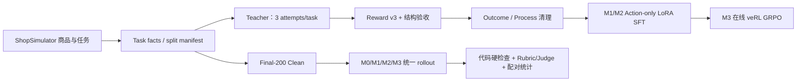

# Shopping GRPO：长程购物 Agent 的后训练复现

> 一个以 ShopSimulator 为环境、以 Qwen3.5-2B 为基座的 Baseline → SFT → GRPO → Evaluation 实验仓库。

[English](README.en.md) · [架构](docs/architecture.md) · [数据流水线](docs/data-pipeline-v1.md) · [结果](docs/results-v1.md) · [复现](docs/reproducibility-v1.md) · [限制](docs/limitations.md)

## 定位 / TL;DR

本项目研究长程购物 Agent 是否能通过监督微调和在线 GRPO 学会可靠的工具使用。Agent 必须在商品环境中搜索、查看详情、选择规格并完成购买，而不是只生成推荐文字。

冻结的 Final-200 Clean 结果（固定分母 200）是：

| 模型 | 严格 gold success |
|---|---:|
| M0 Base | 2/200（1.0%）|
| M1 Outcome SFT | 137/200（68.5%）|
| M2 Process SFT | 130/200（65.0%）|
| M3 GRPO（step50 导出）| 131/200（65.5%）|

主要结论：SFT 带来主要增益（M0→M1 **+67.5pp，p<0.0001**）；Process 选择没有优于 Outcome（M1→M2 **−3.5pp，p=.230**）；在 `lr=1e-6`、LoRA `r=16`、每 prompt `n=4` 的配方下，GRPO 未产生可检测增益（M2→M3 **+0.5pp，exact McNemar p=1.000，CI 含 0**）。GRPO 合同为 `total_training_steps=500`、`save_freq=50`，本次在 100 optimizer steps 后受控停止并选择 step50；基础设施无效率为 1–2%，超过项目设定的 `<1%` 门槛，且保留在评测分母中。

## ShopSimulator

[ShopSimulator](https://arxiv.org/pdf/2601.18225) 是一个面向长程购物 Agent 的中文交互环境。任务会组合商品类别、预算、品牌、型号、功能和颜色/尺寸/容量/套餐等约束。Agent 通过搜索、详情查看、属性核验、变体选择和购买动作与环境交互；终局由确定性的 Reward v3 验证。

仓库内提供冻结的运行时环境，入口位于 [`environments/ShopSimulator/`](environments/ShopSimulator/)。环境版本为 `shopsimulator-environment-v2.1`，Reward 版本为 `shopsimulator-reward-v3`。

## 端到端架构



所有阶段共享环境、工具 schema、Action Guard、Observation 投影和 Reward 版本；运行身份由 manifest/hash 绑定。GRPO 的训练信号只有有效的 Reward v3 终局 utility；LLM Judge 仅用于离线解释，不进入训练奖励或 checkpoint 选择。

## 数据清理

上游压缩商品/任务源解压后包含 **23,421** 条 task facts。固定 split 为 Teacher pool 1,300、GRPO train 1,000、GRPO validation 50 和 Final-200 Clean 200。每个 Teacher task 预留 3 个 attempt；基础设施重试沿用原 request identity，不伪造新策略样本。

清理顺序如下：

1. 按冻结 task、商品、Query 模板、显式型号和商品 family 构建 leakage component，并先隔离 Final-200。
2. 用 Reward v3 检查终局；要求 `done/over`、`reward_valid=true` 和完整 `gold_purchase`。
3. 拒绝非法动作、schema/结构损坏、缺失关键字段和不可验证终局；保留 rejected reason 供审计。
4. 在同一 task 的成功轨迹中构建 Outcome（第一条合格轨迹）与 Process（按 actor-visible 过程特征选择）两套 SFT 数据。
5. 训练和评测只接受 manifest 中的 task，Final-200 不参与数据选择、阈值或 checkpoint 调优。

正式采集的审计计数为 2,100 个有效策略 attempts、2,370 条 append-only raw rows、1,343 条 strict-gold trajectories；硬验收后为 1,265 条轨迹、512 个可用 task。curated split 固定为 train 400、dev 100、reserve 12；经过 24576 token 的 shared-union length gate 与 difficulty-matched reserve 后，真正的 SFT-ready 输入为 train 398 行、dev 100 行，Outcome/Process 的 task set 相同。400 是 curated task 计数，不是最终训练行数。

## 模型矩阵

| 标识 | 初始化 / 数据 | 作用 |
|---|---|---|
| M0 | Qwen3.5-2B base | 原始工具使用基线 |
| M1 | M0 + Outcome Action-only LoRA SFT | 第一条合格成功轨迹 |
| M2 | M0 + Process Action-only LoRA SFT | 同 task 过程感知轨迹选择 |
| M3 | M2 + 在线 GRPO；合同 500 steps；optimizer step 100 受控停止；step50 导出 | 检验在线奖励能否继续提升 |

SFT 只对 Assistant action token 计算 loss，用户 Query 和环境 Observation 被 mask。M3 是从 M2 checkpoint 开始的 LoRA GRPO；冻结合同为 `total_training_steps=500`、`save_freq=50`，本次通过内部 exact-step barrier 在 100 optimizer steps 后受控停止，冻结用于 Final-200 的导出为 step50。

## 训练方法

- SFT：单卡 LoRA，rank 16、alpha 32；Outcome 与 Process 使用相同 task 集，差异只来自轨迹选择。
- GRPO：veRL 0.8.0 在线 rollout，每个 prompt 4 条轨迹，学习率 `1e-6`；合同为 `total_training_steps=500`、`save_freq=50`，本次在 100 optimizer steps 后受控停止。动态采样只处理无信息 group，不更改 Reward 定义。
- 模型合并和导出保留独立 manifest；M3 的 LoRA 必须合并回 M2 基座后再服务。

## 统一评测

四个模型使用同一份 Final-200 Clean、同一环境和同一协议，每题一次 rollout，固定分母为 200。评测依次执行：

- 轨迹规范化、Action Guard、终局 Reward 和基础设施有效性检查；
- 由代码从私有 TaskFacts 生成候选约束，再冻结逐题 Rubric；
- 对通过硬检查的脱敏轨迹进行 Rubric/Judge 解释和过程维度评分；
- 固定分母汇总，并按 task_id 做 exact McNemar 与配对 bootstrap 比较。

基础设施无效任务不会从分母剔除，Judge 侧记为 `not_judged`。Reward、Gold 私有字段、成功标签和其他模型结果不会暴露给 Trajectory Judge。

## Final-200 结果

| 模型 | strict success | infra invalid | mean steps | mean terminal utility |
|---|---:|---:|---:|---:|
| M0 Base | 2/200（1.0%）| 2 | 5.40 | −0.100 |
| M1 Outcome SFT | 137/200（68.5%）| 3 | 12.05 | +0.584 |
| M2 Process SFT | 130/200（65.0%）| 4 | 11.50 | +0.553 |
| M3 GRPO step50 | 131/200（65.5%）| 2 | 11.05 | +0.563 |

配对结果：M0→M1 为 +67.5pp（p<0.0001）；M1→M2 为 −3.5pp（p=.230）；M2→M3 为 +0.5pp（exact McNemar p=1.000，配对 CI 含 0）。详见 [v1 结果报告](docs/results-v1.md)。

## 解释与限制

结果支持“成功轨迹 SFT 是主要能力来源”，但不支持“Process 选择必然更好”，也不支持在本配方之外泛化 GRPO 结论。GRPO 的结果应表述为“在该配方下未产生可检测增益”，而不是普遍宣称有效或无效。

主要限制包括：Final-200 只有一次固定协议运行，未估计随机种子方差；评测依赖 ShopSimulator 的模拟商品与工具界面；1–2% infrastructure invalid 高于 `<1%` 目标；GRPO 合同为 500 steps，但本次在 100 optimizer steps 受控停止，且只使用 LoRA 小更新量和单一学习率；LLM Judge 适合解释，不替代确定性 strict success。

## 快速开始

在 Linux、Python 3.10+、CUDA 和 `uv` 环境中：

```bash
bash scripts/setup.sh
bash scripts/start_environment.sh
```

另开终端启动模型并运行基线：

```bash
bash scripts/serve_model.sh Qwen/Qwen3.5-2B
bash scripts/baseline.sh
```

训练与评测入口：

```bash
bash scripts/sft.sh
bash scripts/serve_model.sh outputs/models/sft-merged
bash scripts/evaluate.sh sft

bash scripts/grpo.sh --dry-run
bash scripts/grpo.sh
bash scripts/export_grpo.sh <checkpoint>/actor <verl-fsdp-export-dir>
PYTHONPATH=src python scripts/merge_grpo_lora.py --help
PYTHONPATH=src python scripts/merge_grpo_lora.py \
  --base-dir <verl-fsdp-export-dir> \
  --output <standalone-hf-dir> \
  --source-run-id <run-id>
bash scripts/serve_model.sh <standalone-hf-dir>
bash scripts/evaluate.sh grpo
```

`export_grpo.sh` only performs the veRL/FSDP export. Because the actor is a PEFT LoRA checkpoint, run `scripts/merge_grpo_lora.py` (inspect `--help` first) to produce a standalone HF model before serving or evaluating it.

完整的版本、hash、检查项和不启动昂贵任务的复现顺序见 [复现指南](docs/reproducibility-v1.md)。

## 目录树

```text
configs/                         运行、工具与 GRPO 配置
data/                            SFT、GRPO、evaluation 输入与 metadata
docs/                            公开架构、数据、结果、复现与限制说明
environments/ShopSimulator/     冻结环境、Reward v3 与商品源
experiments/                     baseline、sft、grpo 与 comparison
experiments/commerce-v1/         v1 结果身份与发布归档的 canonical 命名空间
scripts/                         安装、训练、导出和评测入口
src/shopping_grpo/               环境、SFT、GRPO、评测实现
src/commerce_posttrain/          canonical 数据/运行契约接口
tests/                           单元、契约、入口与回归测试
```

## 复现身份

| 对象 | 冻结身份 |
|---|---|
| 上游 | [YYHDBL/shopping-grpo-longhorizon](https://github.com/YYHDBL/shopping-grpo-longhorizon)，commit `4ed73020e1d7d07eb93e7375a4606b0901d3cded` |
| ShopSimulator | commit `9ecba272963960ab4a10e1a781bd05cd7634ce20` |
| 商品源（压缩） | `f51c33217061479f9c95a1068621fcd38e4883ae3d2f6a1627037bea934f2125` |
| 商品源（解压） | `57b10950a0064d16c81535a1d764a75879a508d250dde8a2a1787c5e6045559f` |
| 当前代码 runtime contract | `5f0967e9dd0cad5f8041484bdb70a6baaf6ee14e8df81f966bf77adbce6e1bac` |
| Final-200 task split | `d99112a20ef47534c27a32e4b38229bf048dcc6b06fef2e3e919aac3093662f5` |
| Final-200 四模型评测记录的 protocol | `0986526cecc9b1a9770c7786b049689a95528c4c6f72a11be78f6400b5049cec` |

完整哈希与验证命令见 [复现指南](docs/reproducibility-v1.md)；私有 TaskFacts、模型权重和逐题轨迹不作为公开 README 的输入。

## 文档导航

- [端到端架构](docs/architecture.md)
- [v1 数据流水线与清理](docs/data-pipeline-v1.md)
- [v1 Final-200 结果](docs/results-v1.md)
- [v1 复现指南](docs/reproducibility-v1.md)
- [限制与后续工作](docs/limitations.md)
- [Reward v3 设计](docs/reward-v3.md)
- [评测协议（实现细节）](docs/evaluation.md)

## 来源与许可状态

本项目归属并引用：[YYHDBL/shopping-grpo-longhorizon](https://github.com/YYHDBL/shopping-grpo-longhorizon)、[ShopSimulator](https://github.com/ShopAgent-Team/ShopSimulator)、[veRL](https://github.com/verl-project/verl) 和 [Qwen](https://github.com/QwenLM/Qwen3)。相关论文与工具的许可请以各上游仓库为准。

本仓库当前没有提交根目录 `LICENSE` 文件；在重新分发代码、环境数据或模型权重前，请分别核对本仓库与所有上游组件的许可和使用条款。本 README 不授予额外许可。
