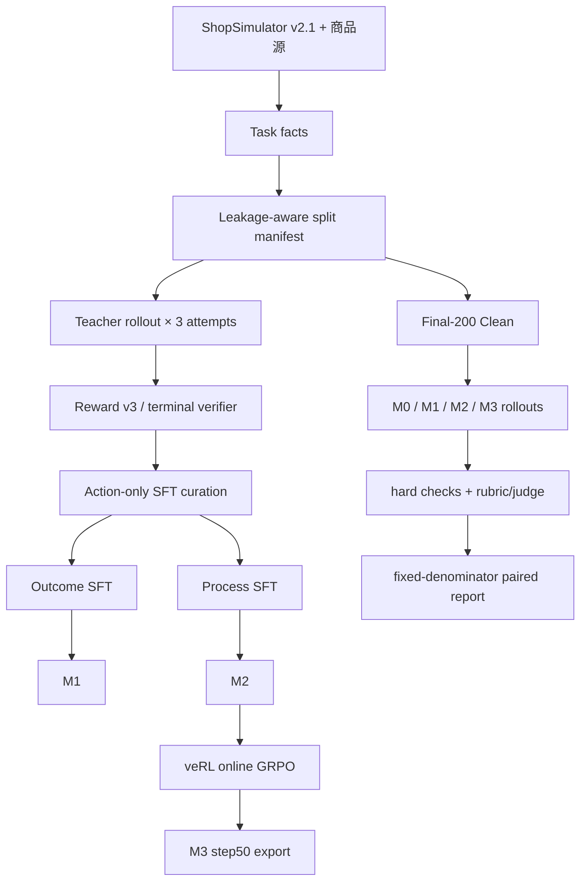

# v1 端到端架构

## 目标

本仓库把长程购物 Agent 的后训练拆成一条可审计链路：同一个 ShopSimulator 运行时、工具协议、Observation 投影和 Reward v3 同时服务 Teacher、SFT、GRPO 与 Evaluation。阶段之间通过 task split、runtime contract 和内容 hash 绑定。

## 数据与运行时

## 组件职责

| 层 | 公开职责 | 主要位置 |
|---|---|---|
| Environment | 搜索、商品详情、变体、购买、终止和 Reward v3 | `environments/ShopSimulator/` |
| Adapter | 工具 schema、Action Guard、session/context、Observation projection | `src/shopping_grpo/environment/` |
| Collection | Teacher 请求、attempt identity、raw append-only store | `src/shopping_grpo/collection/` |
| SFT | 轨迹验收、Outcome/Process 选择、action-token mask | `src/shopping_grpo/training/sft/`、`src/shopping_grpo/collection/sft.py` |
| GRPO | veRL AgentLoop、动态采样和兼容层 | `src/shopping_grpo/training/grpo/` |
| Evaluation | blind guard、rollout、Reward、Rubric/Judge、指标和配对统计 | `src/shopping_grpo/evaluation/` |
| Entry points | setup、训练、导出和评测的薄封装 | `scripts/` |

## 信任边界

Actor 只能看到用户 Query、经过投影的 Observation 和公开工具结果；隐藏 Gold 商品、完整商品库、Reward 私有中间量和其他模型结果不进入 Actor 或 Trajectory Judge。Reward v3 负责确定性终局信号；LLM Judge 只负责脱敏轨迹的离线语义解释，不参与训练奖励或 checkpoint 选择。

评测失败分为可解释的策略失败和 infrastructure invalid。后者不被当成成功或有效零分，也不从 Final-200 分母中删除；Judge 侧以 `not_judged` 表示。

## 关键不变量

- 训练数据与 `data/evaluation/tasks.jsonl` 的 task ID、Query cluster、模板、型号和商品 family 不重叠。
- 严格成功必须是完整的 `gold_purchase` terminal result 且 `reward_valid=true`。
- 同一 protocol hash 才能比较 M0–M3。
- M3 先把 LoRA adapter 合并回 M2 基座，再作为独立模型评测。
