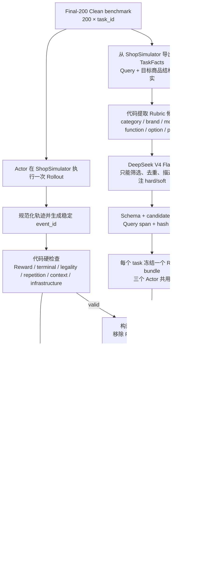

# Evaluation：从一条 Benchmark Test 到最终比较

当前正式分母为 [Final-200 Clean](evaluation-dataset.md)。旧的
[Final-200 Benchmark Dashboard](evaluation-dashboard.html) 仅保留为历史归档。

本项目的正式评估不是“让一个模型看结果后打一个总分”，而是由代码硬检查、
DeepSeek V4 Flash Rubric 整理器、DeepSeek V4 Pro 轨迹 Judge 和最终聚合器组成。
四类结果始终分栏报告，不合成一个不可解释的总分。

> 文档中的 **Rubric** 指“逐任务评分标准”，不是向量检索式 RAG。它由代码候选和
> V4 Flash 共同生成，随后冻结并由 Baseline、SFT、GRPO 三个 Actor 共享。

## 1. 全流程



Rubric 只需要为每个任务生成一次；它不依赖某个 Actor 的轨迹。三个模型随后在相同
任务上各自产生一条 Rollout，并独立交给 Pro Judge，避免 Judge 先看到其他模型的
结果而产生比较偏差。

## 2. Benchmark 中的一条 Test

正式 Final-200 Clean 文件只公开去标识化的评测输入；盲测 Query、目标商品和
TaskFacts 由授权评测环境在运行时恢复，不进入公开训练数据或本页。TaskFacts
仅用于生成候选约束，目标商品私有字段不会进入 Actor，也不会直接进入 Pro Judge。

Final-200 Clean 的约束如下：

- 200 个任务；
- 与 SFT、GRPO train/validation 和历史 benchmark 零重叠；
- SHA-256：
  `d99112a20ef47534c27a32e4b38229bf048dcc6b06fef2e3e919aac3093662f5`；
- 不用于 Prompt 调优、Rubric/Judge 校准或 checkpoint 选择；
- 每个模型每题一次确定性 Rollout。

## 3. 第一位 LLM：V4 Flash 生成冻结 Rubric

### 3.1 代码先生成候选，不让 Flash 自由发挥

代码从 Query、instruction 标注、目标商品结构和 Reward features 提取一个“可能约束”
超集。候选类型包括：

| 类型 | 例子 | 底层表示 |
|---|---|---|
| `category` | 商品应为新娘配件 | `product.category in_category ...` |
| `brand` | 品牌应为某品牌 | `product.brand eq ...` |
| `model` | 型号应为某型号 | `product.model eq ...` |
| `core_function` | 应支持高档/陪嫁等要求 | `product.attributes contains ...` |
| `option` | 颜色或组合规格应选某值 | `purchase.options.* eq ...` |
| `budget_upper` | 价格不超过 100 元 | `purchase.price lte 100` |
| `price_range` | 价格在 80–100 元 | `purchase.price between ...` |
| `price_preference` | 价格在 20 元左右 | `purchase.price approximately 20` |

每个候选都有固定的 `candidate_id`、字段、操作符、期望值、hardness hint、Query
span、数据来源和 selection guidance。V4 Flash 无权创造新的底层字段、操作符或值。

代码会为每个任务生成候选约束，覆盖品类、功能、规格、选项和价格等字段；本页
不复制任何私有任务 ID、Query 或原始 payload。

### 3.2 V4 Flash 的完整 System Prompt

当前冻结版本为 `rubric-curator-v1-draft-r4`，模型为
`deepseek-v4-flash`。下面是代码中的完整提示词：

```text
你是当前 Shopping Agent 项目的需求 Rubric 整理器，不是自由生成需求的助手。

你只能从输入的 candidates 中选择用户 Query 确实表达的约束，并做简短自然语言化。
严禁新增 candidate_id，严禁修改候选的底层字段、操作符或期望值，严禁把目标商品的
全部属性自动视为用户需求。

先保证完整覆盖 Query 中每一个彼此独立的明确要求，再做最小化和去重。“最小”只表示
同义或上下位重复要求不重复计分，绝不表示少选要求。每个 candidate 的
selection_guidance 是强制选择规则。

每条选择必须有 Query 原文直接支持：
- 泛化的目标商品属性不能仅凭常识或商品字段入选；
- 同一用户要求已经由更具体的 option、规格或价格候选覆盖时，不再拆成多个含义重叠
  的泛化 core_function；
- 品类词不能因为碰巧等于目标商品 brand 而被选成品牌约束；
- “适用于/兼容某品牌”是兼容性要求，不代表所购商品自身必须属于该品牌；
- Query 明确给出商品类型时，品类本身是一条独立要求，应和功能、规格分别保留；
- 组合 option 可以承载 Query 明确要求的多个规格，但不能借机加入用户未要求的品牌、
  型号、数量或实质规格；
- 每条入选约束必须提供 Query 中连续、逐字存在且能独立支持该约束的非空原文片段。

例：Query “推荐移动电源”中的“移动电源”是品类，不是品牌；Query “适用于海信
电视的回音壁”要求兼容海信电视，不要求回音壁品牌为海信。

hard/soft 规则：
- 明确品类、明确预算上限、否定要求、指定规格或选项属于 hard；
- “优先、最好、倾向、左右”等偏好属于 soft；
- candidates 中的 hardness_hint 只是代码初筛提示；最终 hard/soft 必须服从 Query
  原文措辞，“最好”等明确偏好不能被强制改成 hard；
- 无法可靠判断时使用 needs_review，不要强行二选一。

只输出一个 JSON 对象：
{
  "selected_constraints": [
    {
      "candidate_id": "c0001",
      "description": "非空、简短、人类可读且不扩写的新描述",
      "hardness": "hard | soft | needs_review",
      "query_quote": "非空且逐字存在于 Query 的连续原文",
      "selection_reason": "非空；说明该候选为何由这段原文直接支持"
    }
  ]
}
不要输出 Markdown、解释性前后缀或任何额外字段。
```

V4 Flash 实际收到的 User 消息只有当前任务的去标识化 Query 和代码生成的候选数组；
具体任务 ID、Query 和候选值不属于公开文档。

### 3.3 代码再次收口

Flash 返回后，代码会检查：

- 只能引用已存在且不重复的 `candidate_id`；
- description、selection reason 非空；
- hardness 只能是 `hard / soft / needs_review`；
- Query quote 必须能回指 Query 的真实连续原文；
- task ID、task-data hash、query hash、extractor/model/prompt 版本完全一致；
- 底层 `field_path / operator / expected_value` 重新从代码候选复制，不能采用模型改写值。

如果 JSON 已解析但 Schema 不合法，系统最多进行有限次数的“只修 Schema”重试，
不会放宽约束或生成默认 Rubric。最终 Rubric 按 `task_id` 缓存，Baseline、SFT、
GRPO 共用同一份。

每个任务最终从候选中选出冻结的 Rubric 条目：

| Rubric | Hardness | 要求 |
|---|---|---|
| `r0001` | hard | 商品品类应为新娘配件 |
| `r0002` | hard | 商品应支持高档 |
| `r0003` | hard | 商品应支持卡通-永结同心 |
| `r0004` | hard | 应选择“【卡通-永结同心】2个装” |
| `r0005` | soft | 价格倾向于 20 元左右 |

正式评测为每个 Final-200 Clean 任务生成一个 Rubric bundle；该 bundle 在模型之间冻结共享。

## 4. Actor Rollout

每个 Actor 使用完全相同的 Collector、System Prompt、工具 Schema 和推理参数：

| 设置 | 值 |
|---|---|
| Environment / Reward | v2.1 / Reward v3 |
| 每题 Rollout | 1 |
| Temperature / top-p | `0.0 / 1.0` |
| 最大环境步数 | 35 |
| 每回合最大生成 token | 512 |
| Context / safety margin | `24,576 / 512` |
| Context compaction | 关闭 |
| Search observation | top 20，预算 1,536 token |
| Product detail observation | 预算 4,096 token |
| Generic fallback | 预算 768 token |

一次 Rollout 会保存用户 Query、Assistant 文本、工具调用、Actor 实际看到的投影后
Observation、Guard 拒绝、每步状态、终局结果和基础审计信息。

Actor Rollout 的具体 Query、商品、动作和 Observation 属于评测运行产物，不在公开
文档中复制；公开结果只保留固定分母的聚合统计。

## 5. 代码硬检查

LLM Judge 之前先进行确定性预处理：

1. 将不同来源的原始 Rollout 规范化成固定 Schema；
2. 为动作尝试、已执行步骤和事件生成稳定 ID，例如 `a0001 / s0000 / e0001`；
3. 计算 Environment Reward 与终局事实；
4. 计算工具次数、步数、候选打开数和购买/放弃次数；
5. 检查 malformed tool call、Action Guard 拒绝、step error 和非法动作；
6. 统计重复动作、重复搜索和 environment repeat loop；
7. 统计 Observation 投影、截断、上下文 token 和 overflow；
8. 检查 release error、任务缺失及其他 `infrastructure_invalid` 情况。

如果轨迹被判为 `infrastructure_invalid`，系统直接生成 `not_judged`，不会要求 Pro
猜一个分数，但该任务仍留在固定 200 题分母中。

## 6. 第二位 LLM：V4 Pro 评价完整轨迹

### 6.1 Pro 实际能看到什么？

`deepseek-v4-pro` 的输入由以下内容组成：

- `task_id` 与 `trajectory_id`；
- 用户原始 Query；
- V4 Flash 已冻结的 Rubric；
- 五个维度及允许分值 `[0, 1, 2]`；
- 冻结的错误类型集合；
- Actor-visible trajectory：
  - Assistant 当时输出的文本；
  - 工具名、参数和环境 action；
  - Actor 当时真正看到的投影后 Observation；
  - Guard 拒绝与 step error；
  - 稳定的 event IDs；
- 仅包含 `done / over` 的中性终局状态；
- 白名单化的代码指标：
  - actions and efficiency；
  - repetition；
  - legality；
  - context；
- 要求输出的严格 JSON Schema。

Pro 明确看不到：

- raw Observation；
- Gold 商品私有字段和 Actor 未看到的候选；
- Reward v3 分数、reward type、hard gates、weighted score；
- strict success、purchase success 或代码给出的成功结论；
- infrastructure validity；
- 其他模型在同一题上的结果。

这种隔离防止 Pro 因为先看到 Reward 或 Gold 答案而倒推“轨迹一定正确”。

### 6.2 Pro 的完整 System Prompt

当前冻结版本为 `trajectory-judge-v1-draft-r3`：

```text
你是当前 Shopping Agent / ShopSimulator 项目的离线轨迹 Judge。

你必须只依据输入中的 actor_visible_trajectory 评价 Actor 的行为。不得假设你能看到
audit raw_observation、Gold 商品私有字段或未展示给 Actor 的候选。输入不会包含
Environment Reward、Reward 分项或代码判定的任务成功结论；这些结果由独立面板
负责，不能由你推断、覆盖或改写。

逐条需求状态只能是 satisfied、violated、unknown、not_applicable。没有可见证据时
使用 unknown。每项判断尽量引用真实 event_id；不得伪造不存在的 event_id。

五个维度分别打 0、1、2 分，不加权、不计算总分：
- search_strategy：搜索是否覆盖品类和关键条件，改写是否有效，是否机械重复；
- candidate_utilization：是否利用可见的高匹配候选，比较是否必要且不过度；
- evidence_verification：购买前是否核验关键属性、规格和最终价格；
- decision_quality：最终选择、规格和购买/放弃决策是否合理；
- termination_efficiency：是否过早购买/放弃、无效探索或耗尽步骤。

错误类型必须从输入提供的 frozen_error_taxonomy 中选择；没有主要错误时 primary
使用 null。只输出 JSON，不输出 Markdown。
schema_version 必须是 shopping-trajectory-judge-v1。禁止输出 total_score、overall_score
或任何综合分。
```

### 6.3 五个评分维度

| 维度 | 0 分 | 1 分 | 2 分 |
|---|---|---|---|
| Search Strategy | 核心条件缺失、无效或机械重复 | 初始搜索合理但改写/收敛一般 | 覆盖关键条件并能有效改写或翻页 |
| Candidate Utilization | 忽略明显高匹配候选 | 候选合理但比较不足或略冗余 | 识别高匹配候选并在必要比较后收敛 |
| Evidence Verification | 未核验关键属性/规格/价格 | 只核验部分关键要求 | 可靠核验所有决策关键证据 |
| Decision Quality | 违反硬约束或错误购买/放弃 | 基本合理但有未满足项或证据缺口 | 商品、规格与决策均有证据支持 |
| Termination Efficiency | 过早终止、循环或耗尽步骤 | 存在轻度冗余 | 证据充分后及时购买或合理放弃 |

Pro 还要逐条输出每个 Rubric 的
`satisfied / violated / unknown / not_applicable`、理由和证据 event IDs，并从冻结
taxonomy 中给出 primary/secondary errors。代码随后验证 Rubric IDs 和 event IDs
必须真实存在，五个维度必须齐全且只能为 0/1/2，禁止 Pro 输出总分。

有效轨迹的 Judge 结果按以下五个维度分别报告：

| 维度 | 分数 | 评价面板 |
|---|---:|---|
| Search Strategy | 0/1/2 | 搜索覆盖和改写质量 |
| Candidate Utilization | 0/1/2 | 候选利用与必要比较 |
| Evidence Verification | 0/1/2 | 购买前关键证据核验 |
| Decision Quality | 0/1/2 | 商品、规格与决策质量 |
| Termination Efficiency | 0/1/2 | 及时终止与无效探索 |

每项结论都引用轨迹中的稳定事件 ID，而不是引用隐藏 Gold；逐题结果和事件内容不公开。

## 7. 最后统计什么？

每道题最终拼装四个互不覆盖的面板：

### A. Reward 与终局

- Reward version/type/valid；
- strict gold success 与 purchase success；
- final reward、terminal utility、weighted score；
- done、over、termination reason；
- hard gates 和 Reward dimension scores。

### B. Query Rubric

- 每条需求的 satisfied/violated/unknown/not_applicable；
- 按 hard/soft 分组统计；
- Reward 与 Rubric 是否发生 disagreement。

Reward 与 Rubric 冲突时两者都保留。例如 Reward 判为 gold，但 Rubric 发现预算自然
语言约束违反时，记录 `reward_rubric_disagreement=true`，不让任一面板覆盖另一方。

### C. 轨迹质量

- Pro Judge 有效覆盖率；
- 五个维度各自的 0/1/2 分布与均值；
- primary/secondary error taxonomy 分布；
- 每条判断对应的 event IDs 和整体诊断。

### D. 确定性行为与基础设施

- executed steps 与 action attempts；
- 各工具调用次数；
- Guard 拒绝和非法动作；
- 重复动作与重复搜索；
- Observation 截断和上下文使用；
- infrastructure-invalid 数量及 task IDs。

汇总时始终以 Final-200 Clean 的 200 为固定分母（Final-183 只是历史归档集，不得进入当前 CLI、summary 或报告标题）。最后按 `task_id` 对 Baseline、SFT、GRPO 做配对比较，
统计成功状态迁移、Reward type 迁移、hard violation 差值、五维分数差值、步数、
Guard 和重复动作变化；仍然不生成一个综合总分。

## 8. M0–M3 Final-200 当前聚合结果

四个里程碑在同一份 Final-200 Clean 上各运行一次，每题一次 rollout，固定分母为
200。严格成功只计完整 `gold_purchase` 且 `reward_valid=true` 的终局；基础设施无效
任务仍保留在分母中。公开结果仅包含聚合值：

| Milestone | Strict gold success | Infrastructure invalid | Mean steps | Mean terminal utility |
|---|---:|---:|---:|---:|
| M0 Base | 2/200 (1.0%) | 2 | 5.40 | -0.100 |
| M1 Outcome SFT | 137/200 (68.5%) | 3 | 12.05 | +0.584 |
| M2 Process SFT | 130/200 (65.0%) | 4 | 11.50 | +0.553 |
| M3 GRPO step50 export | 131/200 (65.5%) | 2 | 11.05 | +0.563 |

配对严格成功差异为 M0→M1 +67.5pp（p<0.0001）、M1→M2 −3.5pp（p=0.230）、
M2→M3 +0.5pp（p=1.000）。GRPO 正式合同为 500 training steps；本次在 optimizer
step 100 通过受控 barrier 停止，并选择 step 50 导出 M3。该结果不外推到其他配方。

## 9. 代码与产物

当前实现按职责拆分在：

```text
src/shopping_grpo/evaluation/
  trajectory.py       原始 Rollout 规范化和 event IDs
  metrics.py          确定性硬检查与行为指标
  task_facts.py       从 ShopSimulator 恢复私有任务事实
  rubric.py           候选提取与 Flash 输出物化
  prompts.py          两个冻结 Prompt 和 Judge-safe 输入
  model_client.py     OpenAI-compatible JSON 请求
  contracts.py        Rubric/Judge Schema 严格校验
  blind_guard.py      Final-200 Clean 内容与 task-ID 防泄漏
  results.py          四面板拼装和固定分母汇总
  comparison.py       Baseline/SFT/GRPO 配对比较
```

正式运行会产生：

```text
shared/task_facts.jsonl
shared/rubric_candidates.jsonl
shared/rubrics.jsonl
MODEL/trajectories.jsonl
MODEL/preprocessed.jsonl
MODEL/judge_requests.jsonl
MODEL/judges.jsonl
MODEL/evaluations.jsonl
MODEL/evaluation_summary.json
model_comparison.json
```

完整轨迹和 Judge 请求可能体积较大且含敏感 payload，因此属于授权环境的 `outputs/`
运行产物；Git 中只提交紧凑的配置与聚合结果摘要。
